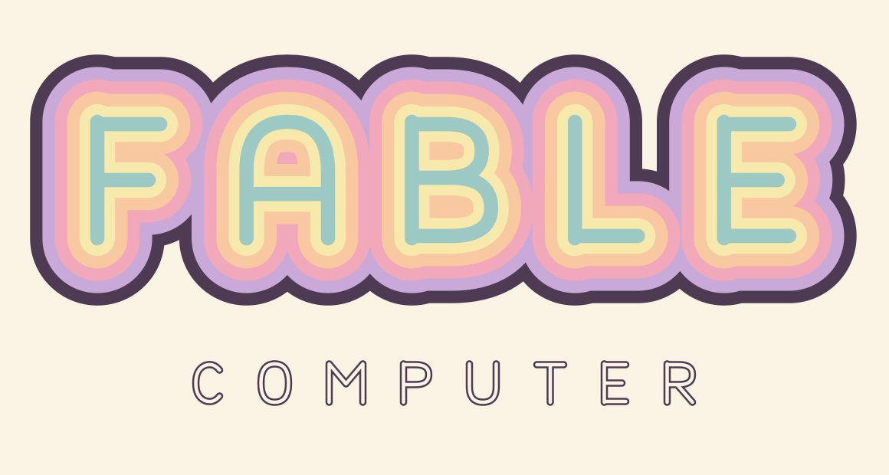

<picture>
  <source media="(prefers-color-scheme: dark)" srcset="branding/boogie-sorbet-dark.svg">
  
</picture>

# This project has moved

### → **[github.com/ryoji-info/FableComputer](https://github.com/ryoji-info/FableComputer)**

---

The **Fable Computer** project now lives in its own dedicated repository:

## **https://github.com/ryoji-info/FableComputer**

That repository is the current, maintained home for the project — the papers, the runnable model chain, the governance and charter documents, and the open community around it. Please head there for the latest version of everything.

*An open feasibility program for room-temperature terahertz computing on a graphene-plasmon fabric — developed in the open, with every number reproducible.*

---

The files in this `hardware solutions` folder are an **older snapshot**, kept here for archival and reference purposes only. They are no longer updated in this location.
